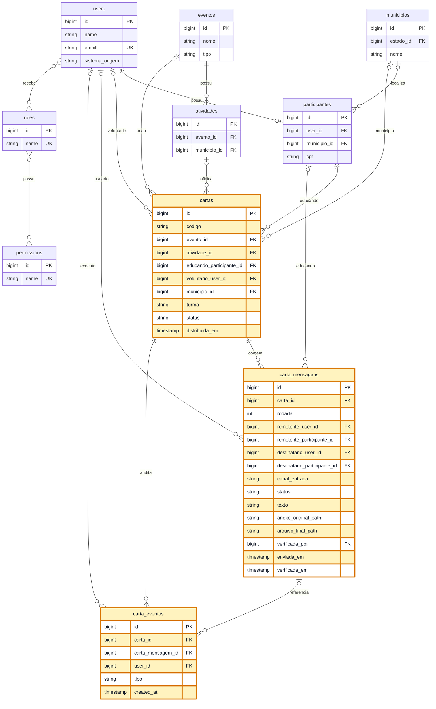

# Modelagem - Cartas para Esperancar

## Contexto

O modulo "Cartas para Esperancar" deve ser integrado ao Engaja, reaproveitando autenticacao, usuarios, participantes, municipios, regioes, eventos, momentos e o controle de papeis/permissoes ja existente.

O PDF da acao descreve uma troca de correspondencias entre educandos da EJA e voluntarios da Petrobras, com upload das cartas digitalizadas na plataforma, distribuicao das cartas aos voluntarios, resposta dos voluntarios pela plataforma e possibilidade de correspondencia continuada sem limite de rodadas.

A revisao do fluxo acrescenta duas regras: a Petrobras nao deve enviar a resposta ja timbrada, e a resposta do voluntario nao deve voltar automaticamente para o alfabetizando. O voluntario pode digitar o texto ou anexar o texto manuscrito; o sistema gera/aplica o timbrado. Depois disso, Jacira/Giovana ou outro perfil autorizado verificam a mensagem antes da disponibilizacao ao alfabetizando.

## Status geral de implementacao

Legenda:

- `[IMPLEMENTADO]`: ja existe no backend ou na estrutura atual.
- `[PARCIAL]`: base tecnica existe, mas ainda falta controller/tela/rotina operacional.
- `[PENDENTE]`: ainda nao foi implementado.

Resumo atual:

| Item | Status | Onde |
| --- | --- | --- |
| Separacao de usuarios por `sistema_origem` | `[IMPLEMENTADO]` | `users`, auth de Cartas e middlewares |
| Cadastro/login/termos/verificacao de e-mail de Cartas | `[IMPLEMENTADO]` | `App\Http\Controllers\Cartas\AuthController` e views `resources/views/cartas/auth` |
| Papeis `cartas_admin`, `cartas_gestao`, `cartas_voluntario` | `[IMPLEMENTADO]` | `database/seeders/RolesPermissionsSeeder.php` |
| Tabelas `cartas`, `carta_mensagens`, `carta_eventos` | `[IMPLEMENTADO]` | migrations `2026_07_07_000003` a `000005` |
| Models do modulo | `[IMPLEMENTADO]` | `app/Models/Cartas` |
| Relacoes com `users`, `participantes`, `eventos`, `atividades`, `municipios` | `[IMPLEMENTADO]` | models existentes e models de Cartas |
| Workflow de envio, aprovacao e ajuste de mensagem | `[IMPLEMENTADO]` | `App\Services\Cartas\CartaMensagemWorkflowService` |
| Aplicacao real do timbrado/PDF final | `[IMPLEMENTADO]` | `App\Services\Cartas\CartaTimbradoService` sobrepoe o texto digitado no PDF timbrado (FPDI); so para resposta digitada |
| Controllers operacionais de cartas, mensagens, verificacao e relatorios | `[PARCIAL]` | `CartaController` cobre cadastro/mensagens/verificacao; relatorios ainda nao |
| Telas de cadastro/lista/resposta/verificacao | `[IMPLEMENTADO]` | views em `resources/views/cartas` |
| Filtro de remetentes pela acao especial (`eventos.is_cartas`) | `[IMPLEMENTADO]` | coluna `is_cartas` (marcada direto no banco), filtro em `CartaController::engajaUsersQuery` |
| Busca no dropdown de remetente | `[IMPLEMENTADO]` | combobox `cpe-combobox` em `gestor/index.blade.php` + `_scripts.blade.php` |
| Envio mostra so o campo da opcao (texto ou anexo) | `[IMPLEMENTADO]` | `data-modo-form`/`cpe-modo-field` em `show.blade.php` + `_scripts.blade.php` |
| Intercalacao (uma carta por vez, alternando os lados) | `[IMPLEMENTADO]` | `Carta::proximoTipoRemetente()` e guardas em `storeMessage`/`respond` |
| Telas de relatorios | `[PENDENTE]` | ainda nao criadas |

## Reaproveitamento do sistema atual

Nao criar novo cadastro de login. Usar:

- `[IMPLEMENTADO]` `users`: autenticacao, nome, email, senha, papeis e separacao por `sistema_origem`.
- `[IMPLEMENTADO]` `participantes`: dados complementares, CPF, telefone, municipio, escola/unidade e tipo de organizacao.
- `[IMPLEMENTADO]` `municipios`, `estados`, `regiaos`: segmentacao territorial.
- `[IMPLEMENTADO]` `eventos`: representa a acao pedagogica "Cartas para Esperancar". A coluna booleana `eventos.is_cartas` marca qual(is) evento(s) sao a acao especial de cartas. A marcacao e feita **direto no banco** (ex.: `UPDATE eventos SET is_cartas = true WHERE id = ?`), nao ha checkbox no formulario. Somente participantes inscritos em um evento com `is_cartas = true` aparecem como remetentes no cadastro de cartas (`CartaController::engajaUsersQuery`).
- `[IMPLEMENTADO]` `atividades`: pode representar os momentos/oficinas em que as cartas foram produzidas.
- `[IMPLEMENTADO]` tabelas do Spatie Permission: controle de acesso restrito ao novo modulo.

O sistema ja possui separacao entre usuarios do Engaja e usuarios do fluxo de Cartas por `users.sistema_origem`. Voluntarios Petrobras e gestores do modulo Cartas devem usar `sistema_origem = cartas`; usuarios operacionais do Engaja continuam com `sistema_origem = engaja`. Como o e-mail passou a ser unico por sistema, uma pessoa pode ter acesso separado aos dois fluxos se necessario.

O `User::booted()` atual cria um `participante` automaticamente para cada usuario. Para o modulo Cartas isso nao muda a regra de dominio: educando e identificado por `cartas.educando_participante_id`, enquanto voluntario Petrobras e gestor sao identificados por `users.id` e papeis/permissoes do modulo.

Turma nao existe como entidade global no Engaja. Hoje ela aparece como texto em agendamentos. Para manter o escopo pequeno, a turma deve ser gravada como `string` no modulo de cartas, como fotografia do dado no momento do cadastro da carta.

## Papeis e permissoes

O acesso ao modulo deve ser por permissao, nao por "todo usuario logado".

Papeis:

- `[IMPLEMENTADO]` `cartas_admin`: administra todo o modulo, edita depois do envio, redistribui cartas e exporta relatorios.
- `[IMPLEMENTADO]` `cartas_gestao`: cadastra cartas, verifica respostas, consulta indicadores e exporta relatorios. Ex.: Jacira/Giovana.
- `[IMPLEMENTADO]` `cartas_voluntario`: visualiza cartas atribuidas a si e envia respostas.

Permissoes:

- `[IMPLEMENTADO]` `cartas.ver`
- `[IMPLEMENTADO]` `cartas.criar`
- `[IMPLEMENTADO]` `cartas.editar`
- `[IMPLEMENTADO]` `cartas.excluir`
- `[IMPLEMENTADO]` `cartas.distribuir`
- `[IMPLEMENTADO]` `cartas.responder`
- `[IMPLEMENTADO]` `cartas.verificar`
- `[IMPLEMENTADO]` `cartas.editar-enviada`
- `[IMPLEMENTADO]` `cartas.relatorio`
- `[IMPLEMENTADO]` `cartas.exportar`

Regras criticas:

- `[IMPLEMENTADO]` enquanto uma mensagem estiver em rascunho, o remetente pode editar;
- `[IMPLEMENTADO]` depois de enviada para verificacao, apenas usuario com `cartas.editar-enviada` pode alterar diretamente;
- `[IMPLEMENTADO]` resposta de voluntario deve ficar em `aguardando_verificacao` ate aprovacao por usuario com `cartas.verificar`;
- `[IMPLEMENTADO]` se a verificacao reprovar, a mensagem fica em `ajuste_solicitado` e volta para correcao do voluntario;
- `[PARCIAL]` o alfabetizando so deve receber/imprimir a resposta apos aprovacao. A regra de status existe; falta tela/rota de entrega ou impressao.

## Tabelas novas

### 1. `cartas` - `[IMPLEMENTADO]`

Representa a dupla/conversa entre um educando e um voluntario. Nao representa cada arquivo individual.

Campos:

| Campo | Tipo | Observacao |
| --- | --- | --- |
| `id` | bigint | PK |
| `codigo` | string | Ex.: `027`; unico por evento |
| `evento_id` | FK nullable | Acao "Cartas para Esperancar - 2026" |
| `atividade_id` | FK nullable | Oficina/momento onde a carta foi produzida |
| `educando_participante_id` | FK | Participante educando |
| `voluntario_user_id` | FK nullable | Voluntario Petrobras atribuido |
| `municipio_id` | FK nullable | Snapshot para filtro rapido |
| `turma` | string nullable | Snapshot da turma |
| `status` | string | Estado atual da conversa |
| `distribuida_em` | timestamp nullable | Quando foi atribuida ao voluntario |
| `encerrada_em` | timestamp nullable | Encerramento manual, se houver |
| `criada_por` | FK users nullable | Usuario que cadastrou |
| `atualizada_por` | FK users nullable | Ultimo usuario que alterou metadados |
| `created_at`, `updated_at`, `deleted_at` | timestamps | Com soft delete |

Status implementados:

- `rascunho`
- `aguardando_distribuicao`
- `aguardando_voluntario`
- `aguardando_verificacao`
- `aguardando_ajuste`
- `aguardando_educando`
- `respondida`
- `encerrada`

Indices:

- unico composto: `evento_id`, `codigo`
- index: `status`
- index: `voluntario_user_id`, `status`
- index: `educando_participante_id`
- index: `municipio_id`, `turma`

### 2. `carta_mensagens` - `[IMPLEMENTADO]`

Representa cada carta enviada dentro da conversa. Como nao ha limite de rodadas, cada ida ou volta vira uma nova mensagem.

Campos:

| Campo | Tipo | Observacao |
| --- | --- | --- |
| `id` | bigint | PK |
| `carta_id` | FK | Conversa |
| `rodada` | integer | 1, 2, 3... |
| `remetente_user_id` | FK nullable | Quem enviou quando existir usuario |
| `remetente_participante_id` | FK nullable | Educando, quando a origem for participante |
| `destinatario_user_id` | FK nullable | Voluntario ou usuario destinatario |
| `destinatario_participante_id` | FK nullable | Educando destinatario |
| `tipo_remetente` | string | `educando`, `voluntario`, `sistema` |
| `canal_entrada` | string | `digitada`, `anexo_manuscrito`, `anexo_digitalizado` |
| `status` | string | `rascunho`, `aguardando_verificacao`, `aprovada`, `ajuste_solicitado`, `cancelada` |
| `texto` | longText nullable | Texto digitado pelo voluntario, quando nao houver anexo manuscrito |
| `anexo_original_path` | string nullable | Upload original: carta digitalizada ou manuscrito do voluntario |
| `anexo_original_nome` | string nullable | Nome original do anexo |
| `anexo_original_mime` | string nullable | Ex.: `application/pdf`, `image/jpeg` |
| `anexo_original_tamanho` | bigint nullable | Tamanho do anexo original em bytes |
| `arquivo_final_path` | string nullable | Documento final gerado pelo sistema, ja com timbrado quando aplicavel |
| `arquivo_final_nome` | string nullable | Nome do documento final |
| `arquivo_final_mime` | string nullable | Ex.: `application/pdf` |
| `arquivo_final_tamanho` | bigint nullable | Tamanho do documento final em bytes |
| `timbrado_aplicado_em` | timestamp nullable | Quando o sistema gerou/aplicou o timbrado |
| `texto_resumo` | text nullable | Transcricao/resumo opcional para busca |
| `enviada_em` | timestamp nullable | Preenchido ao enviar |
| `verificada_por` | FK users nullable | Jacira/Giovana ou outro usuario que verificou |
| `verificada_em` | timestamp nullable | Data da verificacao |
| `parecer_verificacao` | text nullable | Motivo de ajuste ou observacao da verificacao |
| `criada_por` | FK users nullable | Usuario que fez upload |
| `atualizada_por` | FK users nullable | Ultimo editor |
| `created_at`, `updated_at`, `deleted_at` | timestamps | Com soft delete |

Regras:

- `[IMPLEMENTADO]` Para uma mesma `carta_id`, `rodada` deve ser sequencial por indice unico.
- `[IMPLEMENTADO]` O primeiro envio normalmente tem `tipo_remetente = educando`.
- `[IMPLEMENTADO]` As proximas mensagens alternam entre voluntario e educando. A alternancia agora e imposta pelo backend: `storeMessage` (educando) e `respond` (voluntario) so aceitam envio quando e a vez daquele lado e nao ha mensagem pendente. Ver `Carta::proximoTipoRemetente()`, `podeEducandoEnviar()`, `podeVoluntarioEnviar()` e `temMensagemPendente()`.
- `[IMPLEMENTADO]` Anexo original e arquivo final devem apontar para disco privado, nao publico.
- `[IMPLEMENTADO]` Resposta digitada pelo voluntario usa `texto` e gera `arquivo_final_path` com o timbrado aplicado (`CartaTimbradoService`), setando tambem `arquivo_final_*` e `timbrado_aplicado_em`.
- `[IMPLEMENTADO]` Resposta manuscrita pelo voluntario usa `anexo_original_path` como documento final (nao recebe timbrado, por decisao de escopo); `arquivo_final_*` fica nulo.
- `[IMPLEMENTADO]` Aprovacao por `cartas.verificar` muda a mensagem para `aprovada`; reprovacao muda para `ajuste_solicitado`.

Indices:

- unico composto: `carta_id`, `rodada`
- index: `carta_id`, `status`
- index: `remetente_user_id`
- index: `destinatario_user_id`

### 3. `carta_eventos` - `[IMPLEMENTADO]`

Tabela de auditoria para rastrear acoes administrativas e mudancas relevantes. Ajuda porque documentos enviados ficam bloqueados para edicao comum apos envio.

Campos:

| Campo | Tipo | Observacao |
| --- | --- | --- |
| `id` | bigint | PK |
| `carta_id` | FK | Conversa |
| `carta_mensagem_id` | FK nullable | Mensagem afetada, quando houver |
| `user_id` | FK nullable | Quem executou a acao |
| `tipo` | string | Ex.: `criada`, `distribuida`, `mensagem_enviada`, `editada_admin`, `encerrada` |
| `dados_antes` | json nullable | Snapshot antes da mudanca |
| `dados_depois` | json nullable | Snapshot depois da mudanca |
| `created_at` | timestamp | Momento do evento |

Indices:

- index: `carta_id`, `created_at`
- index: `user_id`, `created_at`
- index: `tipo`

## Relacionamentos

`[IMPLEMENTADO]` As entidades `cartas`, `carta_mensagens` e `carta_eventos` sao novas. As demais ja pertencem ao Engaja ou ao Spatie Permission.

As caixas amarelas representam as unicas tabelas novas. As demais mostram somente os campos que o modulo reutilizara do Engaja.

## Fluxo operacional

1. `[IMPLEMENTADO]` Administracao cria (em producao) um `evento` e marca `eventos.is_cartas = true` **direto no banco**. Os participantes inscritos nesse evento passam a ser os remetentes disponiveis no cadastro de cartas.
2. `[IMPLEMENTADO]` Educandos seguem reaproveitando `participantes`; voluntarios Petrobras e gestao do modulo usam `users` com `sistema_origem = cartas`.
3. `[IMPLEMENTADO]` Voluntarios recebem papel `cartas_voluntario`; gestao e administracao recebem seus papeis especificos.
4. `[IMPLEMENTADO]` Gestao ou administracao cadastra uma `carta` para o educando: seleciona o remetente por um dropdown com busca (combobox) que lista apenas participantes da acao Cartas, e anexa a primeira `carta_mensagem` (upload).
5. `[IMPLEMENTADO]` Ao enviar, a mensagem deixa de ser editavel pelo remetente comum.
6. `[PENDENTE]` Administrador distribui manualmente ou automaticamente as cartas para voluntarios.
7. `[IMPLEMENTADO]` Voluntario visualiza apenas as cartas atribuidas a ele e responde digitando texto **ou** anexando manuscrito. A tela mostra somente o campo da opcao escolhida.
8. `[IMPLEMENTADO]` Ao responder digitando, o sistema gera o documento final timbrado (`CartaTimbradoService::aplicar`, via FPDI sobre `public/images/cartas/PAEB_CartasparaEsperançar_PapeldeCarta.pdf`, A5), salva em `arquivo_final_path` (disco `local`, privado) e deixa a mensagem em `aguardando_verificacao`. Respostas manuscritas nao geram timbrado (usam o anexo original). Geometria/caminho em `config/cartas.php`.
9. `[IMPLEMENTADO]` Jacira/Giovana ou outro perfil com `cartas.verificar` aprova ou solicita ajuste no backend.
10. `[PENDENTE]` Apos aprovacao, gestao ou administracao imprime a resposta e registra nova rodada se o educando responder novamente.
11. `[IMPLEMENTADO]` O ciclo pode continuar sem limite, sempre adicionando novas linhas em `carta_mensagens`.
12. `[PENDENTE]` Gestao consulta indicadores e exporta relatorios.

## Distribuicao automatica

`[PENDENTE]` Pode ser implementada sem tabela extra:

- selecionar cartas com `status = aguardando_distribuicao`;
- selecionar usuarios com papel `cartas_voluntario`;
- ordenar voluntarios por quantidade atual de cartas abertas;
- atribuir carta ao voluntario com menor carga;
- preencher `voluntario_user_id`, `distribuida_em` e `status = aguardando_voluntario`;
- registrar evento `distribuida` em `carta_eventos`.

Se futuramente houver regras mais complexas por regiao, disponibilidade ou limite por voluntario, criar uma tabela adicional `carta_voluntario_configuracoes`. Ela nao e necessaria para o primeiro desenho.

## Relatorios

`[PENDENTE]` Consultas principais para gestao:

- total de cartas cadastradas por municipio, regiao, turma e periodo;
- cartas aguardando distribuicao;
- cartas por voluntario;
- tempo medio entre cadastro e distribuicao;
- tempo medio entre distribuicao e resposta do voluntario;
- quantidade de rodadas por carta;
- cartas sem resposta;
- cartas respondidas 1x, 2x, 3x ou mais;
- exportacao de lista detalhada com educando, municipio, turma, voluntario, status e datas.

## Decisoes de escopo

- `[IMPLEMENTADO]` Nao criar tabela de voluntarios separada: voluntario e `user` com papel `cartas_voluntario`.
- `[IMPLEMENTADO]` Nao criar tabela de educandos separada: educando e `participante` existente.
- `[IMPLEMENTADO]` Nao criar tabela de anexos separada agora: cada anexo pertence a uma `carta_mensagem`, e a propria mensagem guarda o anexo original e o arquivo final timbrado.
- `[IMPLEMENTADO]` Nao criar tabela de turmas agora: usar `cartas.turma` como texto, porque o Engaja ainda nao tem turma global.
- `[PARCIAL]` Nao usar storage publico para cartas: os campos foram modelados para storage privado; falta rota autenticada de download/visualizacao.
- `[IMPLEMENTADO]` Nao sobrescrever carta enviada: cada nova resposta deve criar uma nova `carta_mensagem`.

## Migrations

Ordem:

1. `[IMPLEMENTADO]` criar `cartas`;
2. `[IMPLEMENTADO]` criar `carta_mensagens`;
3. `[IMPLEMENTADO]` criar `carta_eventos`;
4. `[IMPLEMENTADO]` atualizar `RolesPermissionsSeeder` com papeis/permissoes do modulo.
